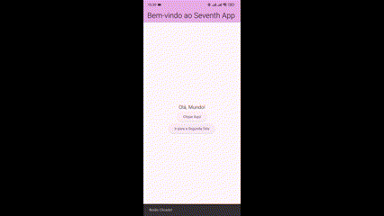

# Teste de Habilidade Técnica - Desenvolvimento Flutter Mobile


Este projeto tem como o objetivo demonstrar habilidade técnica para a criação de uma aplicação Flutter simples, envolvendo a configuração do ambiente de desenvolvimento, a criação de layouts básicos e a implementação de navegação entre diferentes telas.

## Estrutura do Projeto

- **HomeScreen**: Tela inicial com um título, um texto e dois botões. Um dos botões exibe uma mensagem ao ser clicado, e o outro navega para a segunda tela.
- **SecondScreen**: Segunda tela com um título e uma mensagem centralizada.



## Requisitos

- Flutter SDK
- Um emulador ou dispositivo físico para testar a aplicação


## Como Rodar o Projeto

1. Clone o repositório:
    ```bash
    git clone git@github.com:anapppp/PS-Seventh-Flutter.git
    ```
2. Navegue até o diretório do projeto:
    ```bash
    cd seventh_app
    ```
3. Instale as dependências:
    ```bash
    flutter pub get
    ```
4. Execute o projeto:
    ```bash
    flutter run
    ```